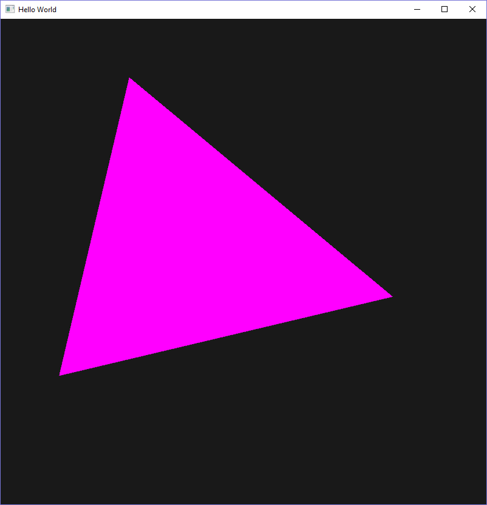

# vs-modern-opengl
Visual Studio 2015 starting point for creating modern OpenGL applications in C++.
Incorporates GLEW (statically-linked), GLFW (statically-linked), and GLM.

Clone and press 'Play', no fiddling required.

The current scene contains a spinning triangle, and you can zoom in and out of the scene by left-clicking and dragging on the window.

Plumbing includes use of a VAO, a VBO, GLFW callbacks, uniform variables, and a basic shader program for you to use as a starting point in your projects.

Two build configurations are included (both 32-bit): Debug and Release.

